# Virtual Artistry

"Virtual Artistry" is a dynamic online platform conceived with the unique aim of showcasing and commercializing diverse works of art. As a vibrant digital marketplace, it provides a much-needed stage for artists to make their creations visible to a global audience. It also acts as a bridge, seamlessly connecting art creators with admirers and prospective buyers, thus fostering a thriving and interactive art community worldwide.

# Table of Contents
- [Virtual Artistry](#virtual-artistry)
- [Table of Contents](#table-of-contents)
  - [Demo](#demo)
    - [A live demo to the website can be found here](#a-live-demo-to-the-website-can-be-found-here)
  - [UX](#ux)
  - [User stories](#user-stories)
    - [Strategy](#strategy)
    - [Scope](#scope)
    - [Skeleton](#skeleton)
    - [Planning](#planning)
    - [Surface](#surface)
    - [Models](#models)
  - [Technologies](#technologies)
    - [Libraries](#libraries)
    - [Frameworks & Extensions](#frameworks--extensions)
    - [Others](#others)
  - [Features](#features)
    - [Existing Features](#existing-features)
    - [Features Left to Implement](#features-left-to-implement)
  - [Testing](#testing)
    - [Validator Testing](#validator-testing)
      - [HTML](#html)
      - [CSS](#css)
      - [WebAim Contrast checker](#webaim-contrast-checker)
      - [Fixed Bugs](#fixed-bugs)
      - [Unfixed Bugs](#unfixed-bugs)
  - [Deployment](#deployment)
    - [Version Control](#version-control)
    - [Heroku Deployment](#heroku-deployment)
  - [Credits](#credits)
    - [Content](#content)
    - [Media](#media)

## Demo

### A live demo to the website can be found [here](https://virtual-artistry-d471b72b3af1.herokuapp.com/)

## UX
This website is primarily targeting art enthusiasts, collectors, and artists. The prime intention is to create an online platform where artists can showcase their work and art lovers can discover, appreciate, and purchase outstanding pieces of art. 

- **Art enthusiasts and collectors**: These are the main users who come to browse, appreciate, and potentially purchase art. They can explore a wide variety of artworks by different artists from the comfort of their homes. They can also interact directly with artists to inquire more about specific pieces of art, leave reviews, and like their favored pieces. 

- **Artists**: From established artists to emerging talents, the site offers an open platform to display their work, get feedback from the community of art lovers, and even sell their pieces. Artists can manage their profile and art adverts and see their work appreciated through likes and comments. 

This user-centric design aims to provide smooth and intuitive navigation, functionality, and interaction tailored to the needs, wants, and expectations of its target audience, making art more accessible and enjoyable for everyone involved.

## User stories

User stories and can be viewed here on the project [kanban board ](https://github.com/users/olliesharp5/projects/3/views/1)

### Strategy

My primary goal in creating "Virtual Artistry" was to design an all-encompassing platform that celebrates art and its creators, making it easy and straightforward for them to connect with art enthusiasts and potential buyers. I aimed to make the artwork the hero and ensure that the platform supported its presentation effectively.

The strategy behind the website can be broken down into several key objectives:

- **For Artists**: To provide artists with a platform to showcase their work, gain exposure and interact with their audience. Artists should be able to easily manage their profiles and advertisements, and have ample opportunities to promote and sell their pieces.

- **For Art Enthusiasts**: For those who appreciate art, the platform should offer a diverse and extensive collection, filters to sort and discover the works that interest them, and an opportunity to interact directly with artists. 

- **For Potential Buyers**: For those looking to buy, the platform should offer clear information about the artwork and artist, a direct line of communication with the artist for inquiries, and ultimately a seamless buying procedure (future implementation).

An important part of the strategy was also to make the platform as user-friendly and accessible as possible. This led to decisions like using a responsive design, intuitive navigation, and incorporating interactive elements such as liking and reviewing pieces.

### Scope

**User Management**
- Registration and authentication for users who wish to create, buy, or appreciate art.
- Differentiation of user roles and permissions allowing for various levels of access: regular user, artist, or admin.
- Detailed profile creation and management, including options such as display name, location, profile image and about information.

**Artist and Artwork Interaction Features**
- Detailed view functionality for artwork including larger image, title, artist name, location, price, year, and condition.
- Direct messaging or contact option between any user and the artist creating an avenue for private conversations regarding the artwork.
- Support for interactive features like liking and reviewing art pieces.

**Artwork Management**
- Creation, editing, and deletion of artwork advertisements by artists, pending admin approval.
- Categorization of artwork based on artist, price, and condition, as selected by the viewer.
- Inbuilt search functionality to discover relevant artists or artworks on the site.

**User Interface and Experience**
- Simple and intuitive interface for ease of navigation throughout the art gallery.
- A responsive design for accessibility on various devices, ensuring a comfortable user experience irrespective of the platform.
- Personalization options for user profiles, allowing a more immersive and individualized user experience.

**Responsiveness** 
- Regardless of the screen size or the device, the website maintains its functionality and aesthetics, providing an optimal user experience across all platforms. 

- It has a mobile-first design approach, ensuring the site looks spectacular and works seamlessly on smaller screens like those of mobile phones and tablets. 

- The use of responsive design principles allows for flexible images and fluid grids. It ensures that the layout adjusts and elements resize depending on the device’s screen size, from the small confines of a smartphone to the wide expanse of a desktop display.

- The navigation menu is collapsible on smaller screens for a clean and user-friendly interface. Similarly, card layouts, buttons, and forms also adjust accordingly to maintain usability and readability.

- This multi-device compatibility not only improves user experience but also enhances the site's SEO performance.

**Website Sections:**
1. **_Base Header and Footer:_** A unified header and footer with functionalities varying based on login status and user role.
2. **_Artwork:_** Artwork catalog with filter options and paginated display encouraging users to register or login.
3. **_Artwork Advert:_** Detailed view of selected artwork with interaction options varying based on user status.
4. **_Artists:_** Paginated display of artists registered on the site with each card displaying profile image, name, and location.
5. **_Artist Profile:_** Summary of an artist including their details and portfolio of published artwork.
6. **_Help:_** A component for submitting customer service requests.
7. **_Profile:_** Personalized user profile with various functionalities including profile editing, password management, and profile deletion.
8. **_Register:_** Registration functionality with role selection and profile creation.
9. **_Login:_** Simple login form with validations to provide appropriate user feedback.
10. **_Logout:_** Functionality to log out with a confirm prompt to ensure intentional actions by the user.

### Skeleton
The website is designed with the principles of both clarity and simplicity. 

- **Header**: The topmost section includes a responsive navigation bar with links to different sections of the site: the title (home), artwork, artists, and help. Depending on the user's role (visitor, regular user, artist, or admin) and the state of login, different options are dynamically displayed in the header.

- **Body**: The body of the site changes dynamically based on the link clicked from the header. It can display the catalogue of all published artwork, detailed view of an artwork, profile view of an artist, form for help requests, user's profile page, or forms for registration and login. 

- **Artwork and Artists' Pages**: These are paginated and sorted in a card display format. 

- **Help Section**: This includes a form through which users can submit their customer service requests.

- **Profile Section**: Here users can view their profile information and depending on their role may edit their adverts, edit profile details, change password, and delete their profile.

- **Register and Login Pages**: Both include forms with validations that display error reason if user's input fails validation.

- **Footer**: The lowermost static part of the site displays copyright information.

The website employs a hierarchical tree structure where the home page serves as the root. The different sections of the site can be accessed from the top-level navigation in the header. The flows from top to bottom are intuitive and provide a seamless user experience.

### Wireframes 

The wireframes were designed using Balsamiq software.

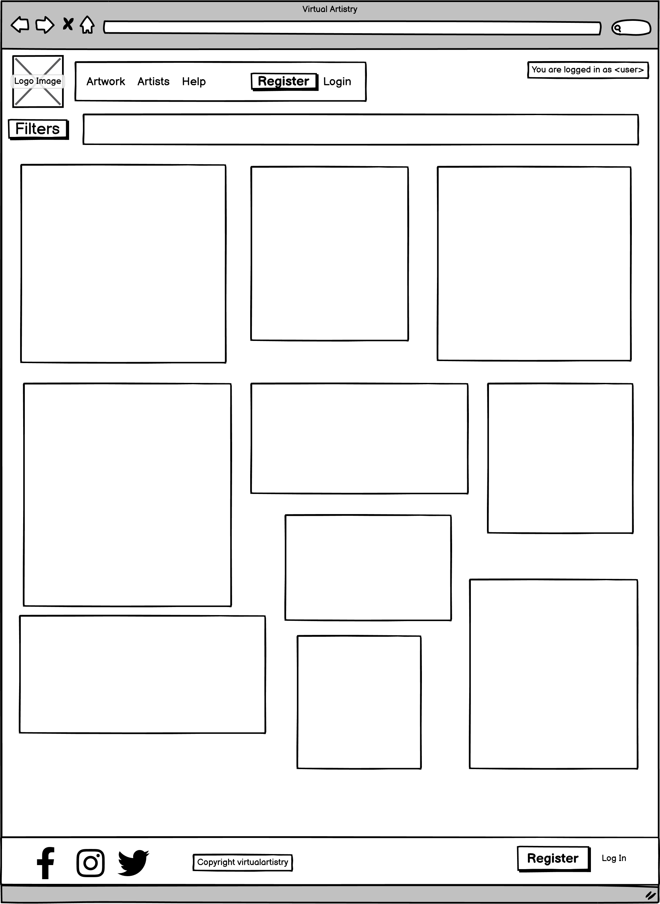 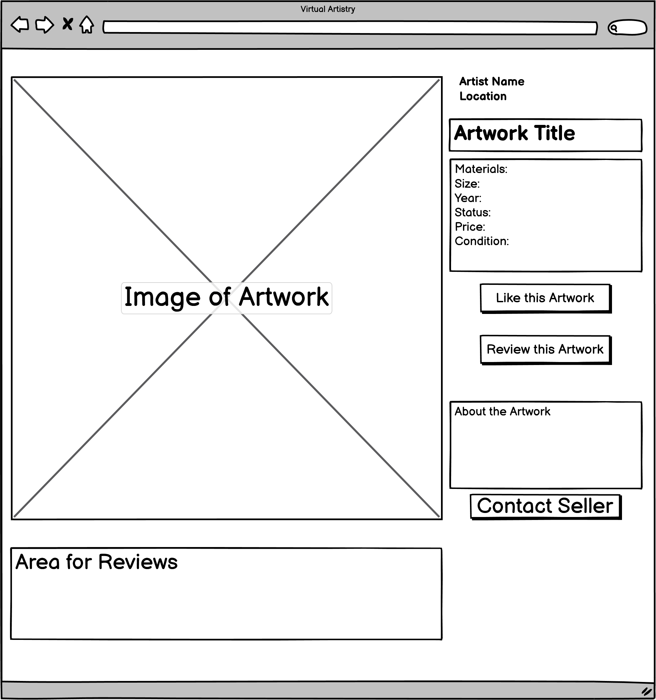 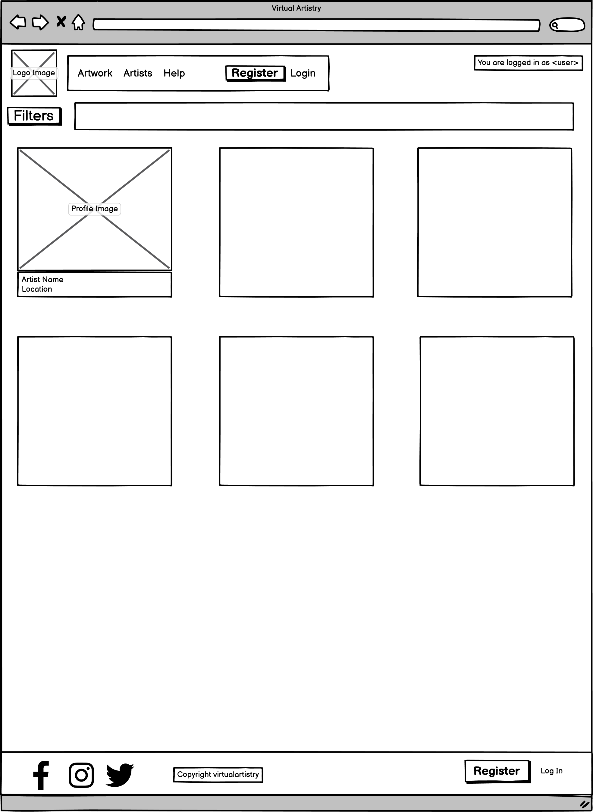
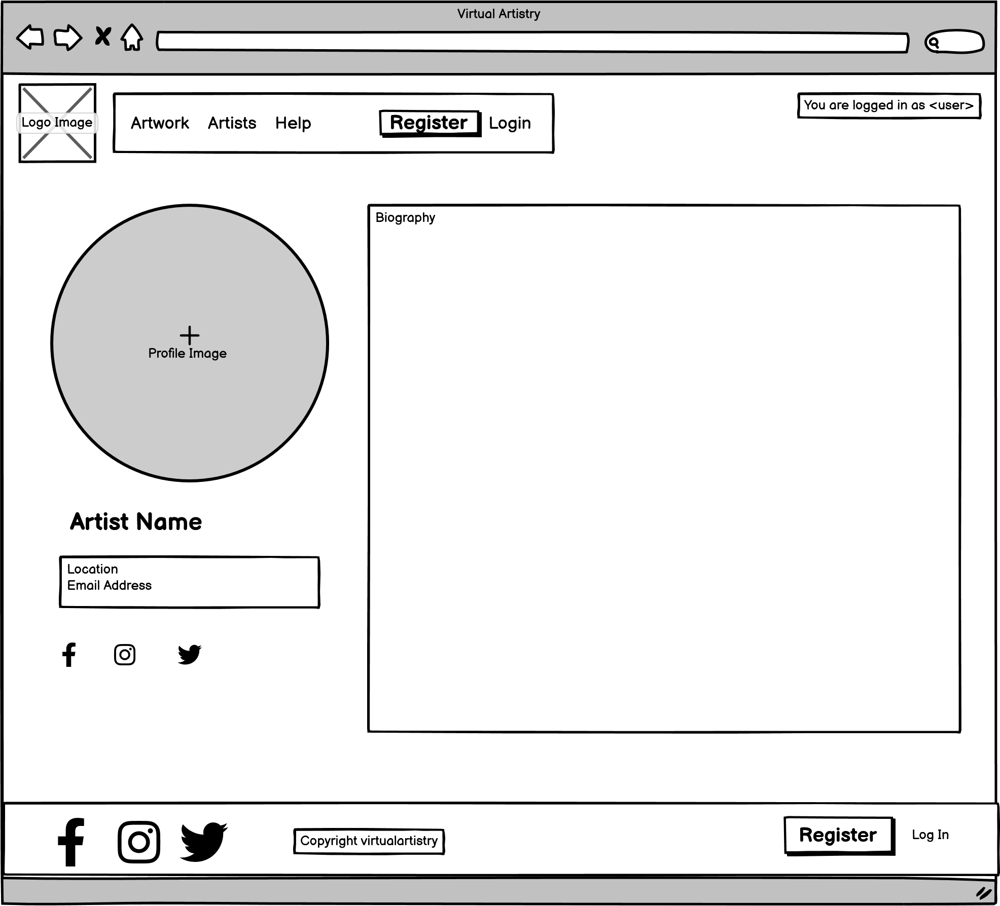 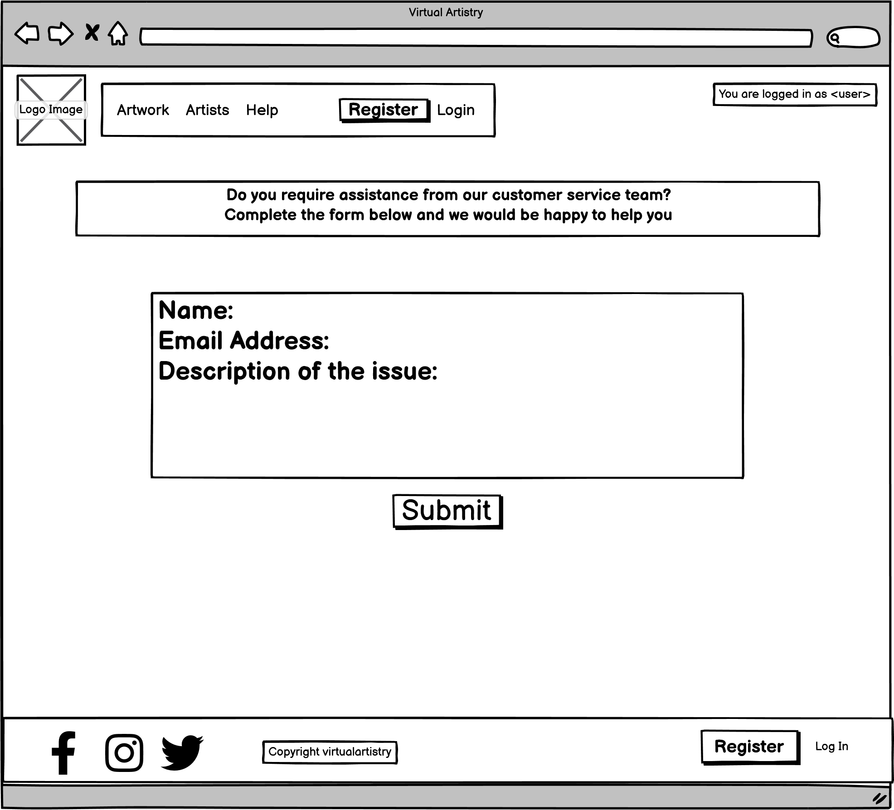

### Planning

I meticulously designed this project using the agile methodology, really showcasing the benefits of a dynamic, iterative development process. My primary planning and communication tool was a Kanban board, which I used to visualize tasks, detail their status and progress, and track individual responsibilities.

I broke down the project into manageable tasks and plotted them on the Kanban board. The board had columns specifying stages such as 'To-Do', 'In Progress', and 'Done'. This allowed me to clearly see what I had accomplished, what I was currently working on, and what still needed to be done.

The use of the Kanban board provided a clear, real-time overview of the project's progress. It facilitated regular reviews, quick adjustments and maintained the fluidity of the development process. This thoughtful planning and organization guided the project towards its successful completion.

[Kanban](https://github.com/users/olliesharp5/projects/3/views/1)

### Surface

The design aesthetics of the site incorporate a color palette that complement detailed visuals of the artwork and a canvas textured background to evoke an artistic atmosphere. For all pages, I chose a canvas-textured background to give a real-life feel of observing art on a canvas. 

I specifically selected the color palette to match the sophistication of an art gallery while ensuring good contrast and accessibility. The key colors used across the site are #5e3c58, a deep purple adding a sense of luxury and creativity;and #faebd7, an antique white that provides a clean, neutral background allowing the artworks to stand out.

| Hex | RGB |
| -------------- | ----------------- |
| #5e3c58 | (94, 60, 88) |
| #faebd7 | (250, 235, 215) |

The font family used across the site is 'Crimson Text', serif. This typography was chosen for its readability and elegance, aligning with the overall aesthetic of an online art gallery.

### Models

#### Artwork App

##### Art

| Field Name | Field Type | Validation/Choices |
| --- | --- | --- |
| title | CharField | max_length=100, unique=True |
| slug | SlugField | max_length=100, unique=True |
| artist | ForeignKey(UserProfile) | on_delete=models.CASCADE, related_name="art_posts" |
| about | TextField |  |
| art_image | CloudinaryField | default='art_placeholder' |
| price | DecimalField | max_digits=10, decimal_places=2 |
| year | PositiveIntegerField | validators=[MinValueValidator(1600), MaxValueValidator(datetime.date.today().year)], default=datetime.date.today().year |
| condition | IntegerField | choices=CONDITION, default=0 |
| created_on | DateTimeField | auto_now_add=True |
| status | IntegerField | choices=STATUS, default=0 |

##### Like

| Field Name | Field Type |
| --- | --- |
| user | ForeignKey(UserProfile) |
| art | ForeignKey(Art) |

##### Review

| Field Name | Field Type | Validation/Choices |
| --- | --- | --- |
| art | ForeignKey(Art) | on_delete=models.CASCADE, related_name="reviews" |
| author | ForeignKey(UserProfile) | on_delete=models.CASCADE, related_name="reviewer" |
| body | TextField |  |
| rating | IntegerField | validators=[MinValueValidator(1), MaxValueValidator(5)] |
| approved | BooleanField | default=False |
| created_on | DateTimeField | auto_now_add=True |

#### Artists App

##### UserProfile

| Field Name | Field Type | Validation/Choices |
| --- | --- | --- |
| user | OneToOneField(User) | on_delete=models.CASCADE, default="1" |
| role | CharField | max_length=2, choices=USER_ROLES, default='RU' |
| display_name | CharField | max_length=100, null=True, blank=True, unique=True |
| location | TextField |  |
| profile_image | CloudinaryField | default='profile_placeholder' |
| about | TextField |  |

#### Help App

##### HelpRequest

| Field Name | Field Type |
| --- | --- |
| name | CharField | max_length=200 |
| email | EmailField |  |
| message | TextField |  |
| created_at | DateTimeField | auto_now_add=True |

## Technologies 

The website is designed using following technologies: HTML, CSS, Bootstrap, Javascript, Django, MarkDown, ElephantSQL, Chrome Dev Tools, Favicon

### Libraries

* [Font Awesome](https://fontawesome.com/v4.7.0/) - Font Awesome icons were used throughout the web-site.

### Frameworks & Extensions

* [Django](https://www.djangoproject.com/) – Django is a high-level Python Web framework that encourages rapid development and clean, pragmatic design.
* [Bootstrap](https://getbootstrap.com/) – Bootstrap is a web framework that focuses on simplifying the development of informative web pages.

### Others

* [GitHub](https://github.com/) - GitHub is a global company that provides hosting for software development version control using Git.
* [Gitpod](https://gitpod.io/workspaces/) - One-click ready-to-code development environments for GitHub.
* [Heroku](https://dashboard.heroku.com/) - Heroku is a cloud platform that lets companies build, deliver, monitor and scale apps.

## Features

### Existing Features

* Base Header and Footer
The base header contains a responsive navigation bar including the title of the site, Artwork, Artists and Help links.  If the user is logged in as an artist, an additional option to create an advert will display. Logged in users, will see their Profile, Logout options as well as a welcoming message. If a user isn't logged in, the Register and Log in options will be displayed in place of the Logout button and welcome message. The base footer contains the standard copyright information.
  

* Artwork
This page showcases all the published artwork in a paginated card format including an image, title, and artist name. There is a filter option to sort the artwork by artist, price, and condition. If user is not logged in, a banner will display advising them to register or login to unlock all the features of the site. 
  

* Artwork Advert 
Clicking on an artwork card brings up a detailed view with information like larger image, title, artist name, location, price, year, and artwork's condition. It also includes sections for About, Like counter, and reviews. If the logged in user is the owner of the artwork, they get options to edit or delete the artwork. Other logged in users will see options to contact seller, like, and review the artwork. Contacting seller will copy their email to clipboard. Likes on the artwork and reviews can be registered by the users. If the user is not logged in, only the artwork information and reviews will display. 
  

* Artists 
This page displays a paginated card arrangement of all registered artists on the site. Cards contain profile image, name, and location of the artists.
  

* Artist Profile
Clicking an artist card will redirect user to their profile. It includes artist's details and a display of their published artwork.
  

* Help 
This page contains a form for users to submit customer service requests, which are saved into the database for subsequent actions. 
  

* Profile
This page displays logged in user's profile with information like assigned role, profile image, display name, location, and about section. There are options to edit profile, manage password, and delete profile. Artists will see additionally their pending artwork adverts for admin approval.  
  

* Register 
Users can register selecting either a regular user, artist or admin role. Following these, they need to fill up user profile details including a display name, location, profile photo and about information. After successful registration, they will be redirected to the home page. If any required field is empty or incorrect, an error message will display.
  

* Login 
Selecting the login button redirects users to a login page where they can enter their username and password. After successful login, they are redirected to the home page. 
  

* Logout 
In order to log out, users need to confirm their action on a prompt. After successful logout, they are redirected back to the main page.
  

### Features Left to Implement

In the future I would like to add, 
1. **Shopping Cart and Checkout**: A functionality to allow users to purchase artwork directly from the website, along with a secure checkout system.

2. **Social Media Integration**: Enable sharing of artists' profiles and individual artworks on various social media platforms to increase traffic and user engagement.

3. **Artwork Auction**: Implement an auction system where users can bid on artwork. This could be an exciting way to promote interaction and sales.

## Testing

* I tested the site, and it works in different web browsers: Chrome, Firefox, and Microsoft Edge.
* On mobile devices, I tested the my site on a Samsung Galaxy S21 Ultra with the Samsung browser and an iPhone 13 with the Safari browser.
* I confirmed that the site is responsive and functions on different screen sizes using the devtools device toolbar.

### Django Testing 

* I tested multiple views in my project which can be found in the tests.py files of my Django project. 

### Manual Testing

| **Website Section** | **Functionality** | **Test Case ID** | **Test Scenario** |**Test Steps** | **Expected Outcome** |
|---------------------|-------------------|------------------|-------------------| --------------|---------------------|
| **_Base Header and Footer_** | Clickable strong social links | #1 | Validate clicking on social links | Click each social link | The associated social page opens up in a new tab |
| **_Register_** | Registration functionality | #2 | Test for registration | Input all required fields and press the register button | Succesful registration with a profile creation |
| **_Login_** | User login form | #3 | Test for login | Input correct user credentials and press login | Successful user login |
| **_Logout_** | User logout| #4 | Test for logout | Press logout button | Successful user logout with a confirmation prompt |
| **_Artwork_** | Filtering artwork | #5 | Test for filtering artwork | Use filter settings and apply | Return a list of artworks matching filter parameters |
| **_Artists_** | Filtering artists | #6 | Test for filtering artists | Use filter settings and apply | Return a list of artists matching filter parameters |
| **_Artwork Advert_** | Creating artwork (Artist account) | #7 | Test for creating artwork | Create new artwork and save | New artwork saved/displayed |
| **_Profile_** | Updating profile details | #8 | Test for updating profile details | Update profile details and save changes | Profile details updated successfully |
| **_Profile_** | Deleting profile | #9 | Test for deleting profile | Follow profile deletion process | Successful profile deletion with confirmation |
| **_Artwork Advert_** | Submitting a review | #10| Test for submitting a review | Write review and post | New review saved/displayed |
| **_Artwork Advert_** | Liking an artwork  | #11| Test for liking an artwork | Click like button | Like count for artwork increases |
| **_Artwork Advert_** | Unliking an artwork | #12| Test for unliking an artwork | Click unlike button (previously liked) | Like count for artwork decreases |
| **_Artwork Advert_** | Updating own review | #13| Test for updating your own review | Edit review text and save changes | Updated review saved/displayed |
| **_Artwork Advert_** | Deleting own review | #14| Test for deleting your own review | Select delete option on self-review | Review successfully deleted |
| **_Help_** | Submitting a help request | #15| Test for submitting a help request | Write help request and submit | Submition of help request was successful |

### Validator Testing

#### HTML
No errors were found when passing through the official W3C validator.

#### CSS
No errors were found when passing through the official (Jigsaw) validator.

#### JSHint
No errors were found when passing through the official (JSHint) validator.

| HTML Validation Screenshots | CSS Validation Screenshot | JavaScript Validation Screenshots |
|:---------------------------:|:-------------------------:|:---------------------------------:|
| 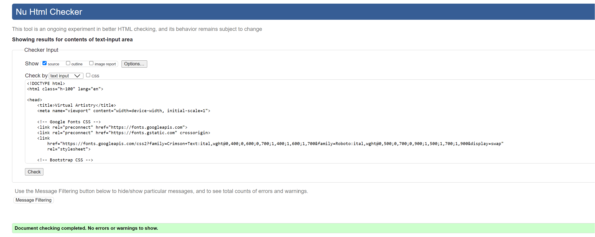 | 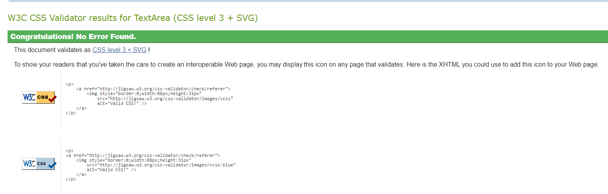 | 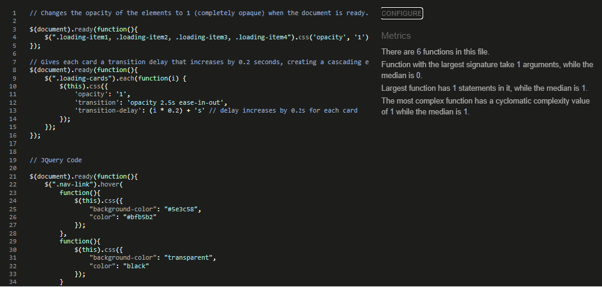 |
| 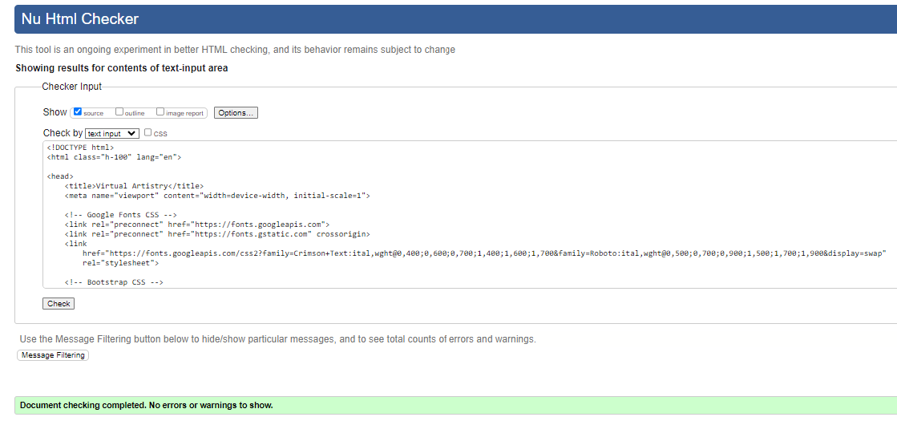 |                           | 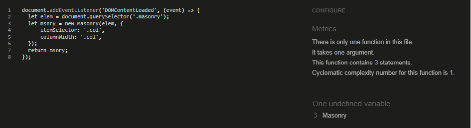 |
| 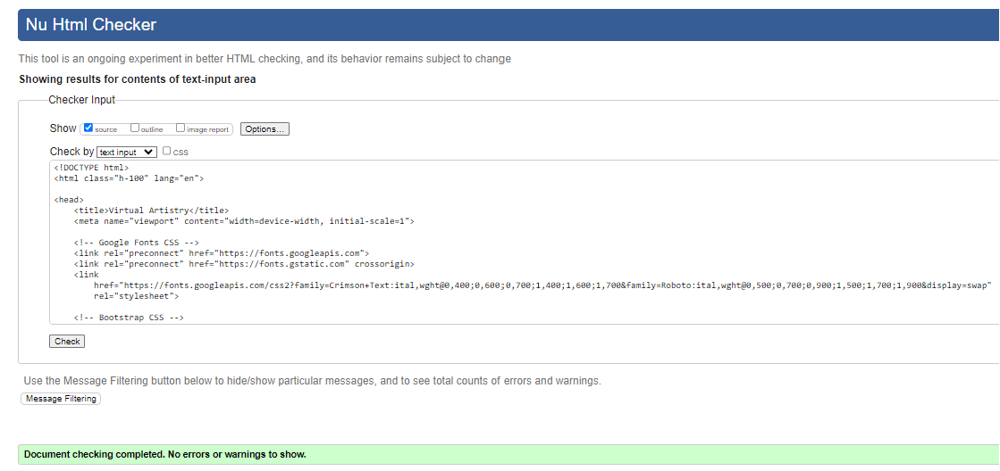 |                           | 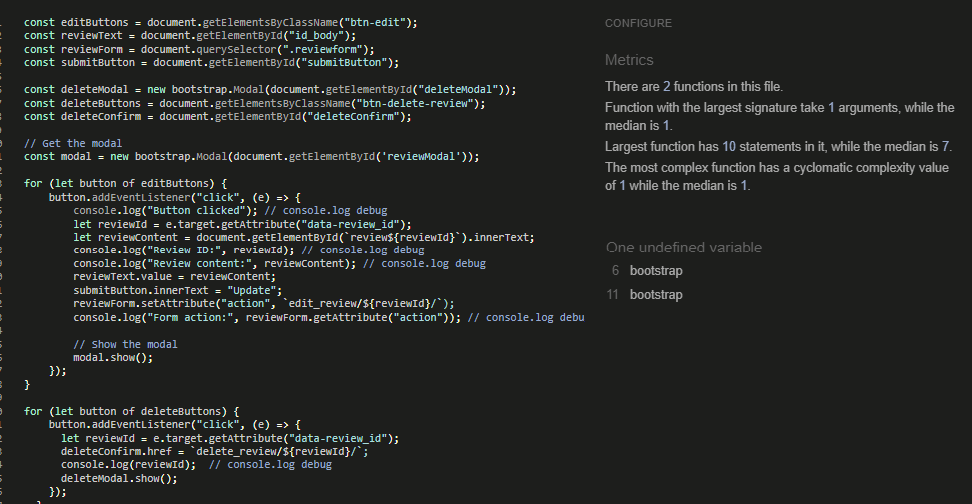 |
| 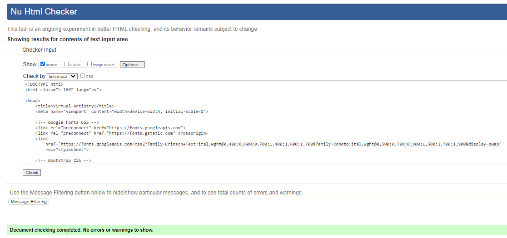 |                           | 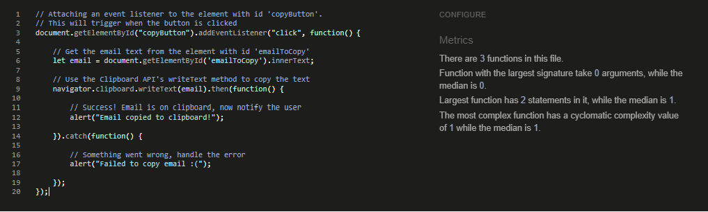 |
| 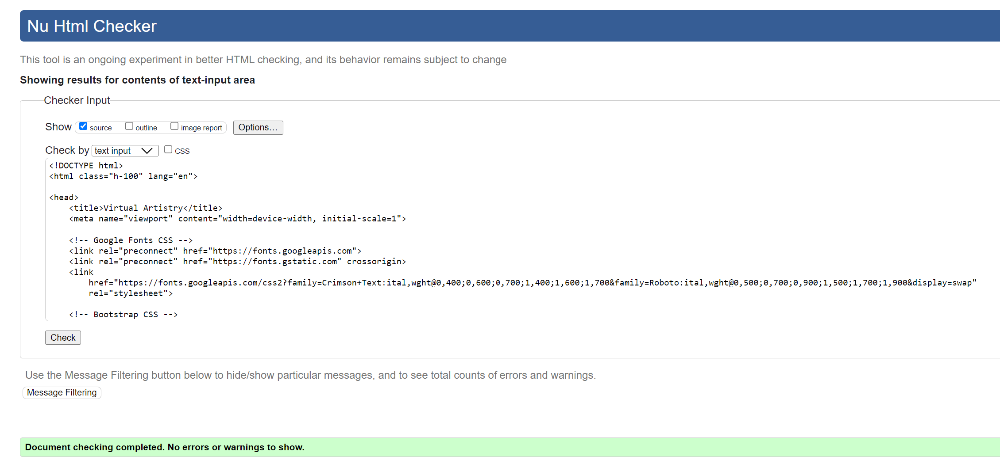 |                           |                                   |
| 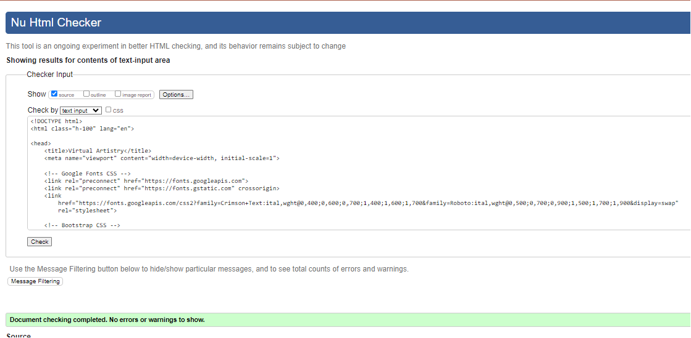 |                           |                                   |
| 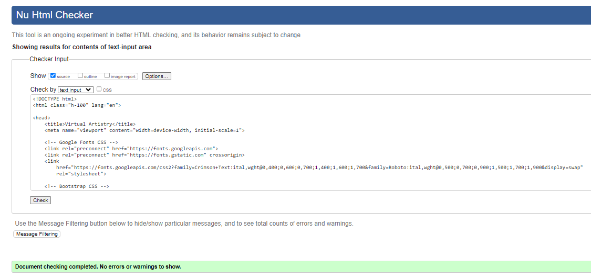 |                           |                                   |
| 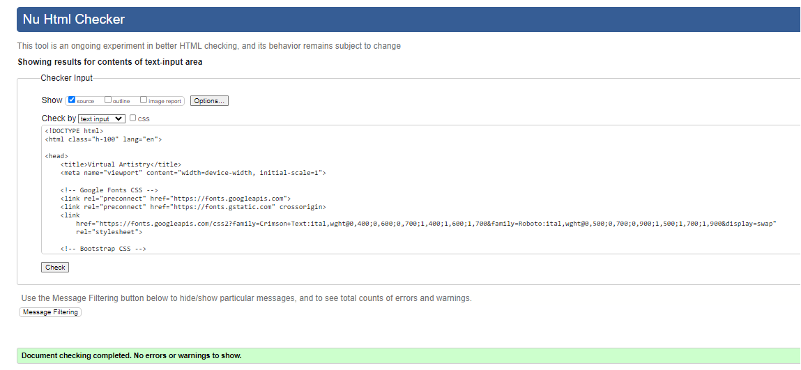 |                           |                                   |
| 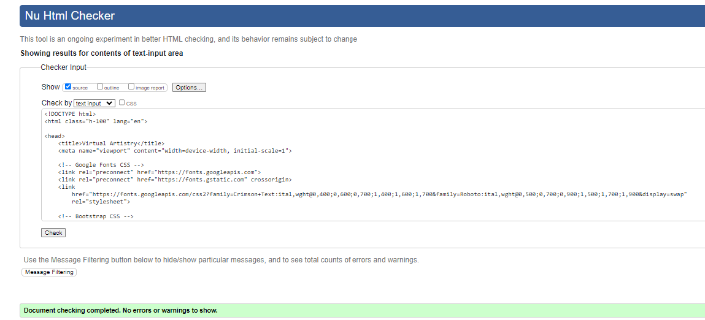 |                           |                                   |
#### WebAim Contrast checker 
No errors were found when passing through the contrast validator.

#### Fixed Bugs

* Unable to render crispyforms 
* Form unable to POST to update a review due to an error in url.py filepath. /art/ needed in front of urlpattern
* reviewId coming through as null. Debugged Js using console.log queries, amended the getAttribute value to data-review_id from review_id to obtain the correct reviewid value. 
* Invalid password format or unknown hashing algorithm. - amended the register view to hash the password before being stored in the database. 

#### Unfixed Bugs

* The masonry style is an experimental feature of Bootstrap5. It has been used in the artwork page to display the cards in a way that compliments both portrait and landscape artwork. This style can somethimes struggle to arrange the tiles correctly, hwoever with a refresh of the page it will resolve. 
* There is a current issue with the size of image being sent to the site by Cliudinary. This is contributing slightly to a longer loading time for the site. In the future I will limit the size of the image being sent through whilst maintaining the aspect ratio. 

## Deployment

### Version Control

The following git commands were used throughout development to push code to the remote repo:

- git add - This command was used to add the file(s) to the staging area before they are committed.

- git commit -m “commit message” - This command was used to commit changes to the local repository queue ready for the final step.

- git push - This command was used to push all committed code to the remote repository on github.

### Heroku Deployment

- Heroku provides a platform for hosting web applications.
- The deployed site will update automatically upon new commits to the main branch.

### Performance
The performance of the website was tested with [Google Lighthouse](INSERT LINK TO REPORT)

**Lighthouse reports:** 

Issues have been highlighted with performance in my Lighthouse reports. These issues have been identified as being related to the Masonry Bootstrap5 style used on the artwork page. Additionally there is some formatting issues in the way Cloudinary brings over images to the site which contributes to loading times. 

These are bugs I hope to resolve in the near future by amending the Masonry Javascript and limiting the image size in Cloudinary. 

* Artwork Page

* Art Advert Page 

* Artists Page 

* Artists Profile Page

* Login/Logout/Register Pages

* Profile Page

## Credits

### Content
* The idea for the offcanvas backdrop to house the filter properties was taken from https://getbootstrap.com/docs/5.0/components/offcanvas/
* Implementation of masonry layout: https://masonry.desandro.com/

### Media

* The icon used for the favicon is from favicon.io
* The icons in the footer were taken from Font Awesome
* Credit provided for background image: https://unsplash.com/photos/white-painted-wall-with-black-line-vS3idIiYxX0?utm_content=creditShareLink&utm_medium=referral&utm_source=unsplash 
* photos for artwork provided by Steve Johnson: https://wolfejohnson.com/